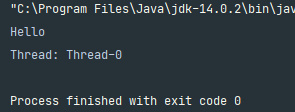

# CompletableFuture

***

## 사전 지식

### 프로그램(Program) 이란

* 사전적 의미
    * 어떤 작업을 위해 실행할 수 있는 파일

### 프로세스(Process) 란

* 사전적 의미
    * 커퓨터에서 연속적으로 실행되고 있는 컴퓨터 프로그램
    * 메모리에 올라와 실행되고 있는 프로그램의 인스턴스(독립적인 개체)
    * 운영체제로부터 시스템 자원을 할당받는 작업의 단위
    * 즉, 동적인 개념으로는 실행된 프로그램을 의미한다.
      <br><br>
* **참고** 할당받는 시스템 자원의 예
    * CPU 시간
    * 운영되기 위해 필요한 주소 공간
    * COde, Data, Stack, Heap의 구조로 되어 있는 독립된 메모리 영역
      <br></br>
* 특징
    * 
    * 프로세스는 각각 독립된 메모리 영역(Code, Data, Stack, Heap의 구조)을 할당받는다.
    * 기본적으로 프로세스당 최소 1개의 스레드(메인 스레드)를 가지고 있다.
    * 각 프로세스는 별도의 주소 공간에서 실행되며, 한 프로세스는 다른 프로세스의 변수나 자료구조에 접글한 수 없다.
    * 한 프로세스가 다른 프로세스의 자원에 접근하려면 프로세스 간의 통신(IPC, Inter-Process Communication)을 사용해야 한다.
        * ex) 파이프, 파일, 소켓 등을 이용한 통신 방법 이용

### 스레드(Thread)란

* 사전적 의미
    * **프로세스 내에서 실행되는 여러 흐름의 단위**
    * **프로세스의 특정한 수행 경로**
    * 프로세스가 할당받은 자원을 이용하는 실행의 단위
      <br><br>
* 특징
    * 
    * 스레드는 프로세스 내에서 각각 Stack만 따로 할당받고 Code, Data, Heap 영역은 공유한다.
    * 스레드는 한 프로세스 내에서 동작되는 여러 실행의 흐름으로, 프로세스 내의 주소 공간이나 자원들(힙 공간 등)을 같은 프로세스 내에 스레드끼리 공유하면서 실행된다.
    * 같은 프로세스 안에 있는 여러 스레드들은 같은 힙 공간을 공유한다. 반면에 프로세스는 다른 프로세스의 메모리에 직접 접근할 수 있다.
    * 각각의 스레드는 별도의 레지스터와 스택을 갖고 있지만, 힙 메모리는 서로 읽고 쓸 수 있다.
    * 한 스레드가 프로세스 자원을 변경하면, 다른 이웃 스레드 (sibling thread) 도 그 변경 결과를 즉시 볼 수 있다.

### 자바 스레드(Java Thread) 란

* 일반 스레드와 거의 차이가 없으며, JVM이 운영체제의 역할을 한다.
* 자바에는 프로세스가 존재하지 않고 스레드만 존재하며, 자바 스레드는 JVM에 의해 스케줄되는 실행 단위 코드 블록이다.
* 자바에서 스레드 스케줄링은 전적으로 JVM이 관리한다.
    * 스레드가 몇 개 존재하는지
    * 스레드로 실행되는 프로그램 코드의 메모리 위치는 어디인지
    * 스레드의 상태는 무엇인지
    * 스레드 우선순위는 얼마인지
* 즉, 개발자는 자바 스레드로 작동할 스레드 코드를 작성하고, 스레드 코드가 생명을 가지고 실행을 시작하도록 JVM에 요청하는 일 뿐이다.

***

#### 현재 동작하고 있는 애플리케이션 (main thread)

```java
    public class App {
    public static void main(String[] args) {
        System.out.println(Thread.currentThread().getName());
    }
}
```

출력: main

***

## Thread 생성

### 1. Thread 상속

```java
package InflearnJava8.completableFuture;

public class App {
    public static void main(String[] args) {
        MyThread myThread = new MyThread();
        myThread.start();
        System.out.println("Hello");
    }

    static class MyThread extends Thread {

        @Override
        public void run() {
            System.out.println("Thread: " + Thread.currentThread().getName());
        }
    }
}
```

#### 출력

  
코드상으로는 스레드가 생성이 되고 실행 후에 Hello 를 출력하지만, 출력은 Hello 가 먼저 출력되고 쓰레드의 이름이 출력이 된다.  
즉 실행순서가 Hello 출력이 먼저임을 보장할 수 없다.

### 2. Runnable 구현

```java
package InflearnJava8.completableFuture;

public class App {
    public static void main(String[] args) {
        Thread thread = new Thread(new Runnable() {
            @Override
            public void run() {
                System.out.println("Thread: " + Thread.currentThread().getName());
            }
        });
        thread.start();
        System.out.println("Hello: " + Thread.currentThread().getName());
    }
}
```

### 3. 람다식

```java
package InflearnJava8.completableFuture;

public class App {
    public static void main(String[] args) {
        Thread thread = new Thread(() -> {
            System.out.println("Thread: " + Thread.currentThread().getName());
        });
        thread.start();
        System.out.println("Hello: " + Thread.currentThread().getName());
    }
}
```


